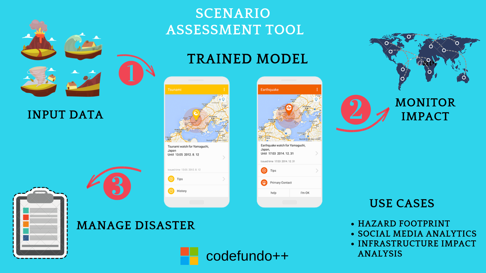

# Scenario Assessment Tool

# Challenge

Find better ways to save lives and prevent economic losses through mechanisms to predict, prevent, or manage the impact of natural disasters.

# Solution

Disaster preparedness activities aim to reduce the impact of disasters by being better prepared to respond when a disaster occurs. 

In order to better anticipate requirements during a disaster, contingency planning activities can be undertaken prior to a disaster based on a realistic disaster scenario.

**SAT** is a tool that can inform this process.

**SAT** estimates the impact to people and infrastructure from potential hazard scenarios. 

By using **SAT**, disaster managers can develop scenarios of disaster impacts (people and infrastructures affected) to inform their contingency plan and emergency response operation plan.

# How it Works 

**[1]** Processes Data of the affected area to predict Impact degree

**[2]** Uses QGIS to generate real-time maps for monitoring the affected area

**[3]** Provides social media analytics of impacted places.

**[4]** Predicts population affected due to the disaster based on the location and magnitute of the disaster.

**[5]** Generates relief requirement reports for the affected areas.

**[6]** Helps launch SMS campaigns from single window to impart survival instructions & actionability plans in case of no Internet connectivity.

# Technology Stack

**[1]** Azure Stack

**[2]** Machine Learning

**[3]** Python 2.7

**[4]** Jupyter Notebook

**[5]** Way2SMS API

**[6]** QGIS
# Conclusion

**SAT** is a one stop solution for Disaster Managers to efficiently manage and develop actionable plans in a time bound manner.
